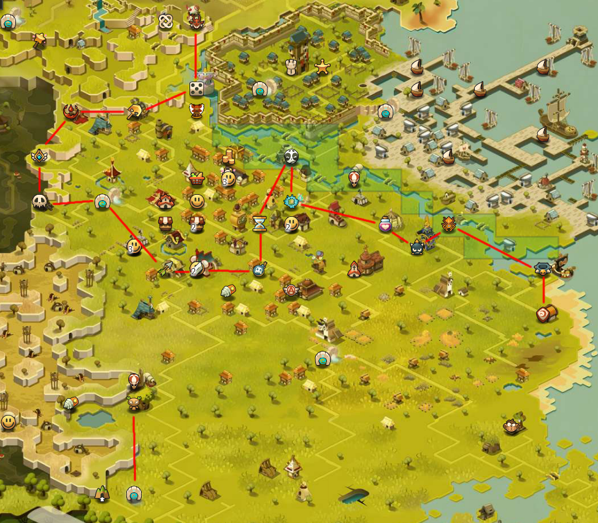

Application of the traveling salesman problem to the dopples in Dofus. A short project because I wanted to experiment with the TSP problem with teleportation (zaap in this case).

Solution:

Notice that it's faster to haversack from the Sram temple to the -2,0 zaap then go to the huppermage, but i think it's overkill.